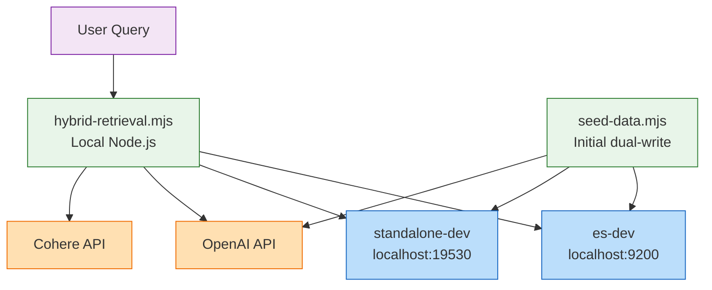
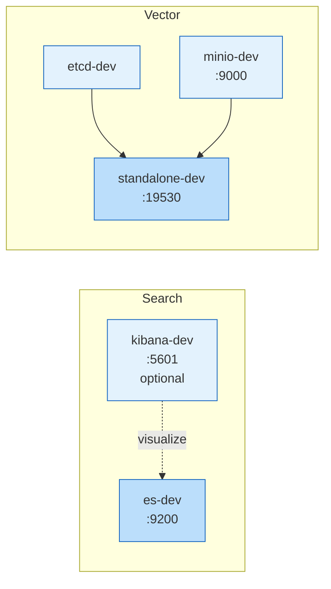
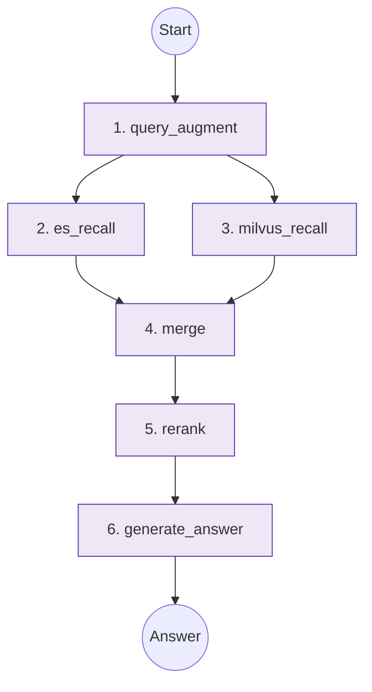

# ElasticSearch RAG — Hybrid Retrieval + Rerank

A hybrid-recall RAG demo using **Elasticsearch (keyword)** + **Milvus (vector)**, orchestrated with **LangGraph**: query expansion → dual recall → merge & dedupe → Cohere rerank → GPT answer generation.

Sample data: 10 English **life notes** in index `life_notes`.

## Tech Stack

| Stage | Solution |
|-------|----------|
| Keyword recall | Elasticsearch 8.17 + IK (`ik_smart`) |
| Vector recall | Milvus 2.5 (`text-embedding-3-small`, 1024-dim) |
| Query expansion | OpenAI `gpt-4.1-mini` |
| Rerank | Cohere `rerank-multilingual-v3.0` (free Trial key) |
| Generation | OpenAI `gpt-4.1-mini` |
| Orchestration | LangGraph `StateGraph` |

## Architecture

Split into **three diagrams** plus tables — avoids one overcrowded chart.

---

### Diagram 1 · Deployment (who talks to whom)



| Component | Type | Role |
|-----------|------|------|
| `hybrid-retrieval.mjs` | Local script | LangGraph pipeline, reads `.env` |
| `es-dev` | Docker | Keyword search, index `life_notes` |
| `standalone-dev` | Docker | Vector search, collection `life_notes` dim=1024 |
| OpenAI API | Cloud | Expansion, embedding, generation |
| Cohere API | Cloud | Rerank `rerank-multilingual-v3.0` |

---

### Diagram 2 · Docker Compose (`docker compose up -d`)

Rerank runs on **Cohere cloud**, not inside Docker.



| Container | Port | RAG required | Role |
|-----------|------|--------------|------|
| `es-dev` | 9200 | Yes | ES 8.17 + IK, `life_notes` |
| `kibana-dev` | 5601 | No | ES UI |
| `etcd-dev` | 2379 internal | Milvus dep | Metadata |
| `minio-dev` | 9000 / 9001 | Milvus dep | Object storage |
| `standalone-dev` | 19530 | Yes | Milvus 2.5 vector DB |

Startup order: `es` healthy → `kibana`; `etcd` + `minio` healthy → `standalone`.

Volumes: `volumes/es` · `volumes/milvus` · `volumes/etcd` · `volumes/minio` · `volumes/kibana`

---

### Diagram 3 · RAG pipeline (LangGraph)



| Step | Node | Calls |
|------|------|-------|
| 1 | `query_augment` | OpenAI Chat → 3 retrieval queries |
| 2 | `es_recall` | `es-dev:9200` · `multi_match` + `ik_smart` |
| 3 | `milvus_recall` | `standalone-dev:19530` · vector Top-K |
| 4 | `merge` | In-memory merge, dedupe by `metadata.id` |
| 5 | `rerank` | Cohere API · Top-3 |
| 6 | `generate_answer` | OpenAI Chat · grounded answer |

`es_recall` and `milvus_recall` run in parallel after `query_augment`.

## Prerequisites

- Docker Desktop
- Node.js 18+
- [pnpm](https://pnpm.io/) (or npm)
- OpenAI API Key
- [Cohere](https://cohere.com) Trial API Key (free, no card required)

## Quick Start

### 1. Install dependencies

```bash
pnpm install
```

### 2. Configure environment

Copy and edit `.env` (listed in `.gitignore` — never commit secrets):

```env
# OpenAI — Chat & Embedding
OPENAI_API_KEY=sk-...
OPENAI_BASE_URL=https://api.openai.com/v1
MODEL_NAME=gpt-4.1-mini

OPENAI_EMBEDDING_BASE_URL=https://api.openai.com/v1
OPENAI_EMBEDDING_MODEL=text-embedding-3-small
OPENAI_EMBEDDING_DIMENSIONS=1024

# Cohere — Rerank
COHERE_API_KEY=your-cohere-trial-key
COHERE_RERANK_MODEL=rerank-multilingual-v3.0
```

### 3. Start infrastructure

```bash
docker compose up -d
```

Wait until core services are healthy (~30–60s):

```bash
docker ps --format 'table {{.Names}}\t{{.Status}}'
# es-dev, minio-dev, standalone-dev should be healthy
curl http://localhost:9200
```

| Service | Port | Description |
|---------|------|-------------|
| Elasticsearch | 9200 | Keyword search |
| Kibana | 5601 | ES UI |
| Milvus | 19530 | Vector search |
| MinIO Console | 9001 | Milvus storage (`minioadmin` / `minioadmin`) |

### 4. Seed sample data (dual-write ES + Milvus)

```bash
node src/rag/seed-data.mjs
```

Verify document count:

```bash
curl http://localhost:9200/life_notes/_count
# expect count: 10
```

> After changing embedding model or dimensions, re-run `seed-data.mjs` and rebuild the Milvus collection.

### 5. Run hybrid RAG

```bash
node src/rag/hybrid-retrieval.mjs
```

Output includes: query expansion, ES/Milvus hits, rerank results, and final LLM answer.

## Project Structure

```
ElasticSearch-learn/
├── docker-compose.yml          # ES + Kibana + Milvus stack
├── elasticsearch/Dockerfile    # ES 8.17 + IK plugin
├── src/
│   ├── rag/
│   │   ├── seed-data.mjs       # Dual-write ES + Milvus
│   │   ├── query-augment.mjs   # GPT query expansion
│   │   └── hybrid-retrieval.mjs # LangGraph RAG pipeline
│   └── rerank/
│       ├── cohere-rerank.mjs   # Cohere rerank (default)
│       ├── tei-rerank.mjs      # Local TEI rerank (optional)
│       └── dashscope-rerank.mjs # DashScope rerank (China)
└── volumes/                    # Docker data (gitignored)
```

## Rerank Options

Default: **Cohere API** — no local rerank container.

| Option | File | When to use |
|--------|------|-------------|
| Cohere | `cohere-rerank.mjs` | **Recommended**: Mac / overseas, free Trial key |
| TEI local | `tei-rerank.mjs` | Linux x86 or `brew install text-embeddings-inference` |
| DashScope | `dashscope-rerank.mjs` | Alibaba Cloud (China) |

> **Apple Silicon**: Docker amd64 TEI segfaults under QEMU. Use Cohere or native Homebrew TEI instead.

Swap reranker by changing the `reranker` instance in `hybrid-retrieval.mjs`.

## FAQ

### Milvus won't start after `docker compose up`

MinIO healthcheck must use `mc ready local` (older `curl`-based checks report false unhealthy). Use the `docker-compose.yml` in this repo.

### `ConnectionError` on `localhost:9200`

ES container is down:

```bash
docker compose up -d es
curl http://localhost:9200
```

### `ECONNREFUSED 127.0.0.1:19530`

Milvus not running. Ensure `standalone-dev` is healthy:

```bash
docker compose up -d
docker ps --filter name=standalone-dev
```

### Cohere rerank errors

- Set `COHERE_API_KEY` in `.env`
- Trial keys are rate-limited

### Changing embedding model

After updating `OPENAI_EMBEDDING_MODEL` / `OPENAI_EMBEDDING_DIMENSIONS`:

1. Drop Milvus collection (or clear `volumes/milvus`)
2. Re-run `node src/rag/seed-data.mjs`

Indexing and querying must use the same model and dimension.
